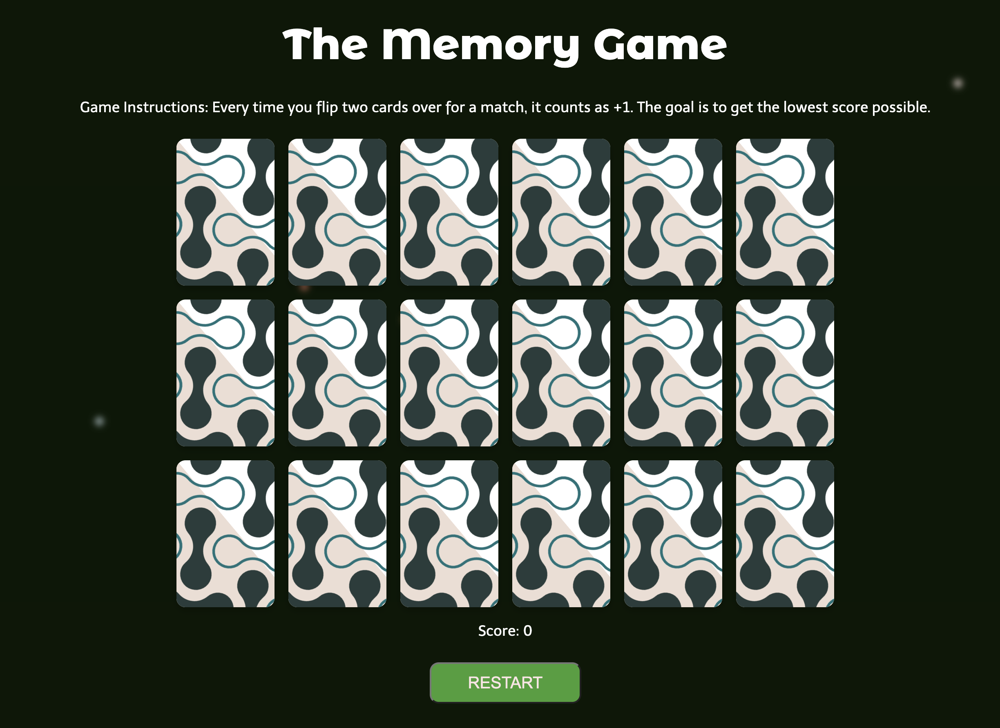

# Memory-Game-Project

## Overview
Welcome to the Memory Game, a fun and engaging game to test your memory skills. Every time you flip two cards over for a match, it counts as +1. The goal is to get the lowest score possible.

## Features
- **Interactive Gameplay:** Flip cards to find matching pairs.
- **Score Tracking:** Keep track of your score as you play.
- **Responsive Design:** Enjoy the game on any device, thanks to a mobile-responsive layout.
- **Animated Snowflakes:** Experience a beautiful snowfall effect in the background as you play.

## How to Play
1. Click on a card to flip it over.
2. Try to find another card that matches the first card's image.
3. If the cards match, they will stay flipped, and your score increases.
4. If they don't match, remember what was on each card, and try again.
5. The game ends when all pairs are matched.

## Technologies Used
- HTML
- CSS
- JavaScript
- [Tailwind CSS](https://tailwindcss.com/)

## Setup and Installation
To run the Memory Game locally, follow these steps:
1. Clone the repository to your local machine.
2. Open the `index.html` file in a web browser.

[Edit in Codeflow ⚡️](https://stackblitz.com/~/github.com/AbigailBrandon/Memory-Game-Project)